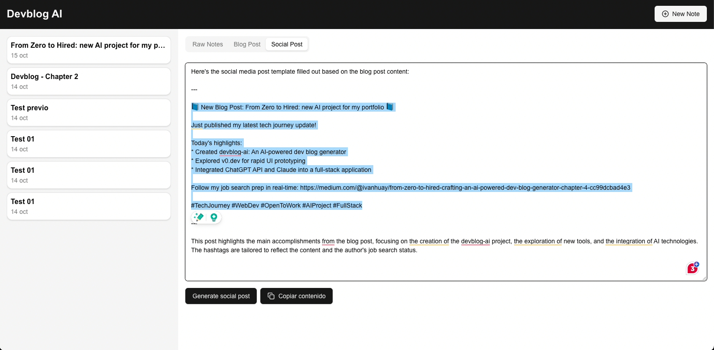

# Devblog AI - Monorepo (Beta)

Devblog AI is a local platform that uses raw notes and the ChatGPT API to automatically generate full dev blog posts. This monorepo contains both the API (backend) and the UI (frontend) projects, which can be run together using Docker.

## Prerequisites

- **Docker** and **Docker Compose** installed on your local machine.
- A **ChatGPT API key**, as it is required to generate the content.

## Getting Started

To run the project locally with Docker, follow the steps below.

### 1. Clone the Repository

First, clone this repository to your local machine:

```bash
git clone https://github.com/ivanhuay/devblog-ai.git
cd devblog-ai-monorepo
```

### 2. Set Up the API

Navigate to the API directory and set up the environment variables:

```bash
cd ./devblog-ia-api
cp .env.template .env
```

Make sure to update the \`.env\` file with the necessary values:
- **CHATGPT_API_KEY**: You need to provide your ChatGPT API key here for the blog generation feature to work.
- The default database configuration for MongoDB is already set. If necessary, adjust the \`DB_URL\`, \`DB_PORT\`, or \`DB_NAME\` in the \`.env\` file.

### 3. Set Up the UI

Similarly, navigate to the UI directory and configure the environment variables:

```bash
cd ./devblog-ia-ui
cp .env.template .env
```

In the \`.env\` file, set the **NEXT_PUBLIC_API_URL** to point to the API:

```
NEXT_PUBLIC_API_URL=http://localhost:4001
```

This ensures the UI connects to the backend correctly.

### 4. Run the Application

After setting up both the API and UI, return to the root directory of the project:

```bash
cd ..
```

Now, you can run the entire application using Docker Compose:

```bash
docker-compose up --build
```

Docker will build and run the following services:
- **API**: Available at \`http://localhost:4001\`
- **UI**: Available at \`http://localhost:3000\`
- **MongoDB**: The database service, used by the API.

### 5. Open the Application

Once the services are up and running, navigate to \`http://localhost:3000\` in your browser to access the Devblog AI application.

## Usage

1. **Create a Note**: On the main page, click the "Create Note" button to input your raw notes.
2. **Generate Blog Post**: After inputting your notes, go to the "Blog Post" tab and click on "Generate". The app will use the ChatGPT API to generate a full blog post based on your notes.
3. **Review and Edit**: You can review and edit the generated blog post directly in the editor.
4. **Generate Social Post**: Once satisfied with your blog post, navigate to the "Social Post" tab and click "Generate". This will create a shorter social media version of the post.
5. **Edit and Save**: You can edit the final social media post in the "Social Post" tab. The final version will be stored automatically for future use.

## Environment Variables Overview

### API (\`devblog-ia-api/.env\`)
- \`PORT=4001\`: Port on which the API will run.
- \`DB_URL=mongodb://mongodb:27017\`: MongoDB connection string.
- \`DB_NAME=devblog\`: Name of the MongoDB database.
- \`CHATGPT_API_KEY=your-api-key\`: Required API key for ChatGPT integration.

### UI (\`devblog-ia-ui/.env\`)
- \`NEXT_PUBLIC_API_URL=http://localhost:4001\`: The URL for the API, used by the UI to communicate with the backend.

## License

This project is licensed under the MIT License.
